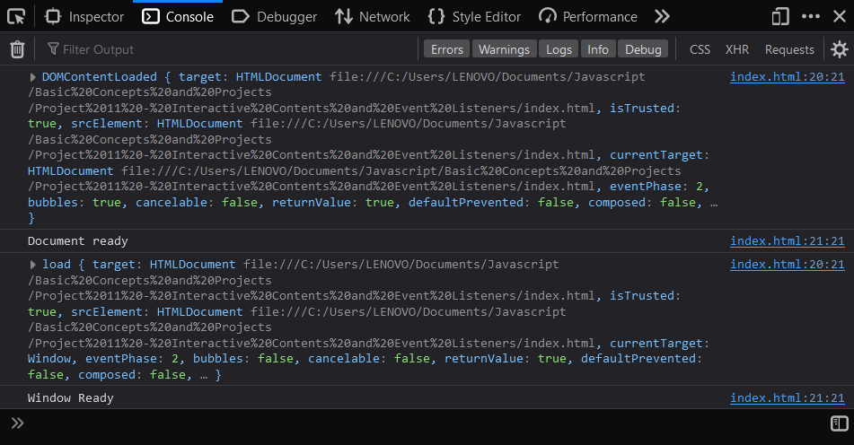

# Interactive Contents and Event Listeners

## Practice Exercise 1
Regular mode and dark mode.
```html
<body>
    <p id="mode" onclick="darkMode()">Click here for dark mode</p>
    <script>
        let darkMode = false;
        document.getElementById("mode").onclick = () => {
            console.log(darkMode);
            if(!darkMode) {
                document.body.style.backgroundColor = "black";
                document.body.style.color = "white";
                document.getElementById("mode").innerText = "Click here for light mode";
                darkMode = true;
            } else {
                document.body.style.backgroundColor = "white";
                document.body.style.color = "black";
                document.getElementById("mode").innerText = "Click here for dark mode";
                darkMode = false;
            }
        }
    </script>
</body>
```

## Practice exercise 2
Create several divs with color names in `textContent`. Add JavaScript to add `click` event listeners to each element, and as each element is clicked, update the background color of the body to match the color name in the div.

```html
<body>
    <div id="text">Red</div>
    <div id="text">Orange</div>
    <div id="text">Yellow</div>
    <div id="text">Green</div>
    <div id="text">Blue</div>
    <div id="text">Violet</div>
    <script>
        let texts = document.querySelectorAll("#text");

        texts.forEach((el) => {
            el.style.color = el.innerText;
        });

        texts.forEach((el) => {
            el.addEventListener("click", () => {
                document.body.style.backgroundColor = el.textContent;
            })
        })
    </script>
</body>
```

## Practice exercise 3
Using a basic HTML file, the below exercise will demonstrate the order of loading for the window object and the document object using DOMContentLoaded, which is an event that fires once the document object content is loaded in the browser. The window object will load afterward, even if the window.onload statement comes first.

```html
<body>
    <script>
        document.addEventListener("DOMContentLoaded", (e) => {
            message("Document ready", e);
        });
        window.onload = (e) => {
            message("Window Ready", e);
        }
        function message(messageStr, event) {
            console.log(event);
            console.log(messageStr);
        }
    </script>
</body>
```
Console:



## Practice exercise 4
Our aim is to change the background color of the element on the page as the various mouse events occur. On `mousedown` over the element, the element will turn green. When the mouse is over the element, it will turn red. As the mouse moves out of the element boundaries, the color will turn yellow. When the mouse is clicked, the color will go green, and when the mouse is released, it will change to blue. The actions also be logged in the console.

```html
<body>
    <div class="block" style="width: 100px; height: 100px; background-color: pink;"></div>
    <script>
        const block = document.querySelector(".block");

        block.textContent = "hello world";

        block.addEventListener("mousedown", function (e) { changeColor("green", e); } );
        block.addEventListener("mouseover", function (e) { changeColor("red", e); } );
        block.addEventListener("mouseout", function (e) { changeColor("yellow", e); } );
        block.addEventListener("mouseup", function (e) { changeColor("blue", e); } );

        function changeColor(color, event) {
            console.log(event.type);
            block.style.backgroundColor = color;
        }
    </script>
</body>
```

## Practice exercise 5
Change the text in a div element on the page. This exercise will demonstrate how you can get the value from an input field and place it within a page element. It also covers tracking button clicks and details about the event target.

```html
<body>
    <div class="output"></div>
    <input type="text" name="message" placeholder="Your Message">
    <button class="btn1">Button 1</button>
    <button class="btn2">Button 2</button>
    <div>
        <button class="btn3">Log</button>
    </div>
    <script>
        const output = document.querySelector(".output");
        const myInput = document.querySelector("input[name='message']");
        const button1 = document.querySelector(".btn1");
        const button2 = document.querySelector(".btn2");
        const button3 = document.querySelector(".btn3");
        const log = [];

        button1.addEventListener("click", tracker);
        button2.addEventListener("click", tracker);
        button3.addEventListener("click", (e) => {
            console.log(log);
        });

        function tracker(e) {
            output.textContent = myInput.value;
            const ev = e.target;
            console.dir(ev);
            const temp = {
                message: myInput.value,
                type: ev.type,
                class: ev.className,
                tag: ev.tagName
            };
            log.push(temp);
            myInput.value = "";
        }
    </script>
</body>
```

