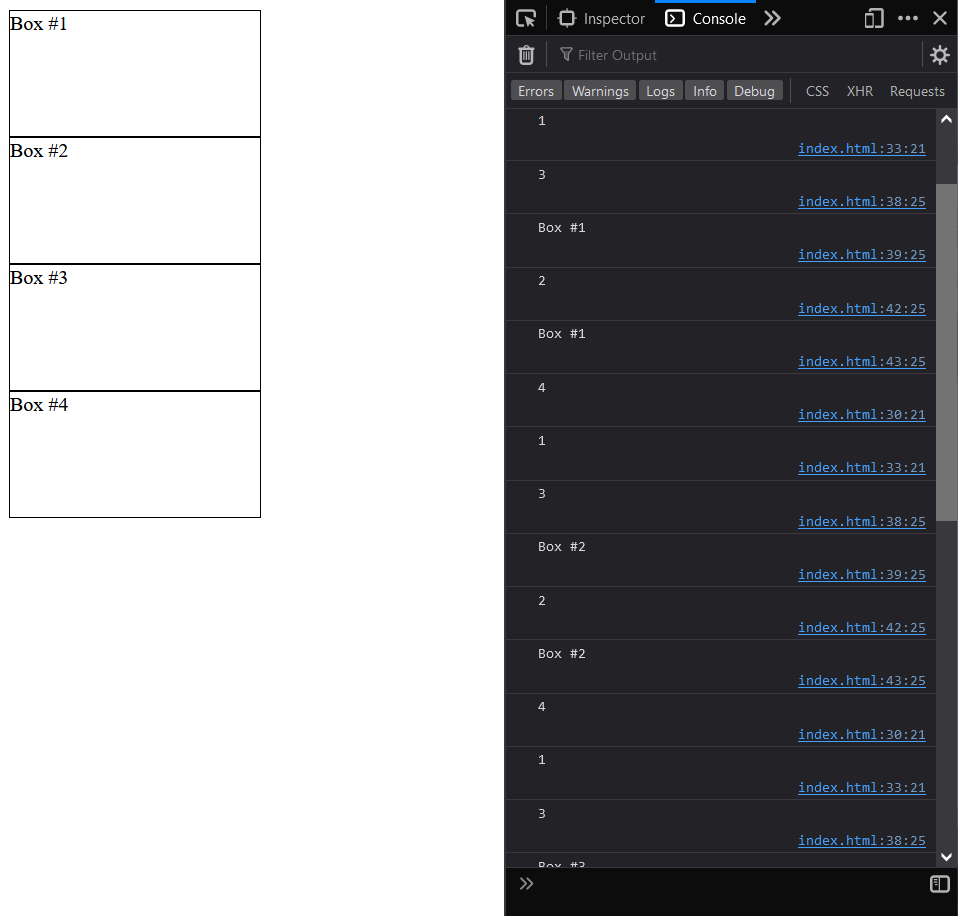
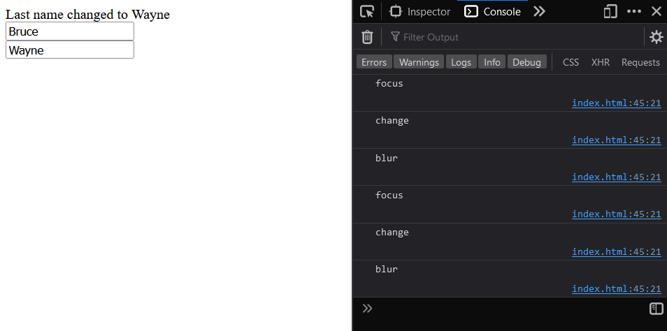
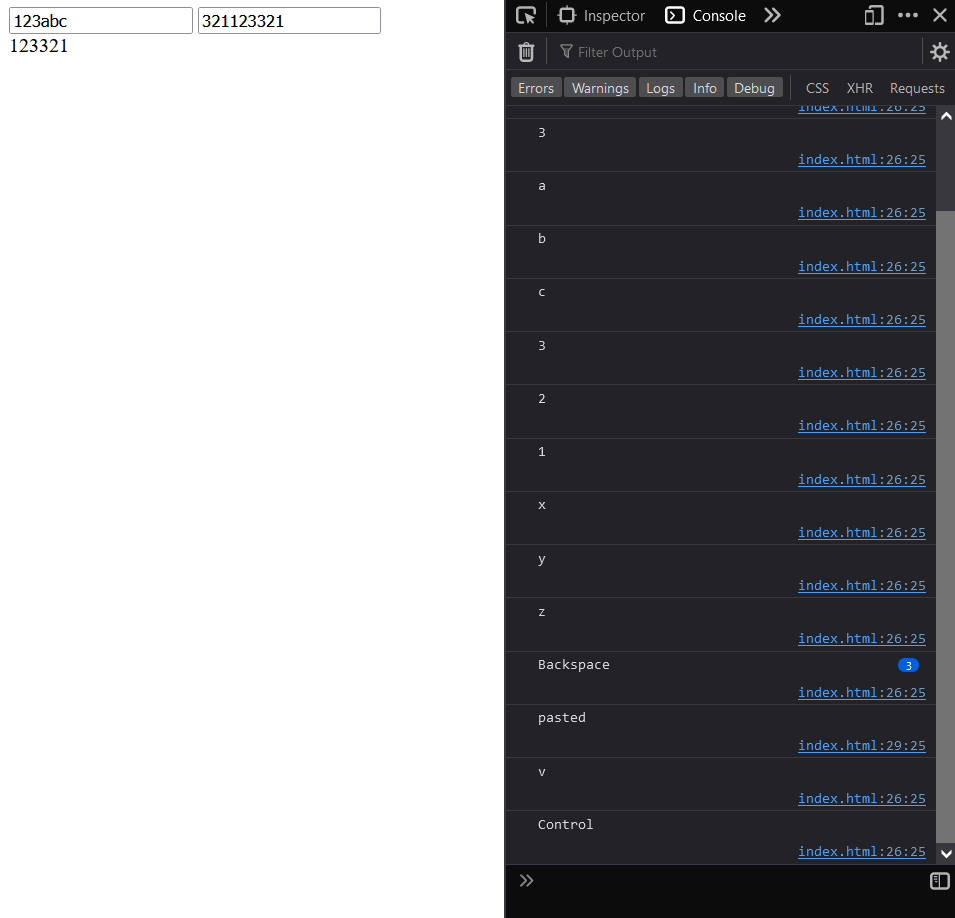
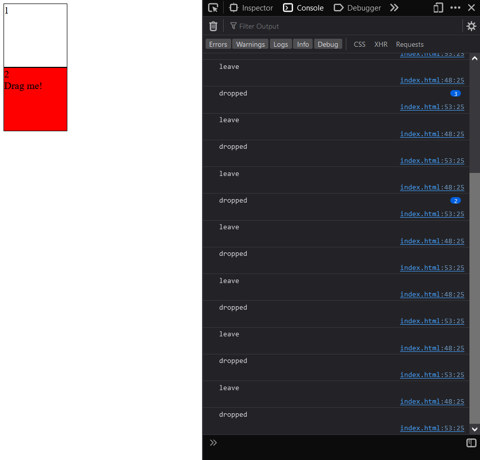
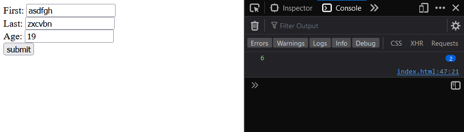

# Interactive Contents and Event Listeners

## Practice Exercise 1
Regular mode and dark mode.
```html
<body>
    <p id="mode" onclick="darkMode()">Click here for dark mode</p>
    <script>
        let darkMode = false;
        document.getElementById("mode").onclick = () => {
            console.log(darkMode);
            if(!darkMode) {
                document.body.style.backgroundColor = "black";
                document.body.style.color = "white";
                document.getElementById("mode").innerText = "Click here for light mode";
                darkMode = true;
            } else {
                document.body.style.backgroundColor = "white";
                document.body.style.color = "black";
                document.getElementById("mode").innerText = "Click here for dark mode";
                darkMode = false;
            }
        }
    </script>
</body>
```

## Practice exercise 2
Create several divs with color names in `textContent`. Add JavaScript to add `click` event listeners to each element, and as each element is clicked, update the background color of the body to match the color name in the div.

```html
<body>
    <div id="text">Red</div>
    <div id="text">Orange</div>
    <div id="text">Yellow</div>
    <div id="text">Green</div>
    <div id="text">Blue</div>
    <div id="text">Violet</div>
    <script>
        let texts = document.querySelectorAll("#text");

        texts.forEach((el) => {
            el.style.color = el.innerText;
        });

        texts.forEach((el) => {
            el.addEventListener("click", () => {
                document.body.style.backgroundColor = el.textContent;
            })
        })
    </script>
</body>
```

## Practice exercise 3
Using a basic HTML file, the below exercise will demonstrate the order of loading for the window object and the document object using DOMContentLoaded, which is an event that fires once the document object content is loaded in the browser. The window object will load afterward, even if the window.onload statement comes first.

```html
<body>
    <script>
        document.addEventListener("DOMContentLoaded", (e) => {
            message("Document ready", e);
        });
        window.onload = (e) => {
            message("Window Ready", e);
        }
        function message(messageStr, event) {
            console.log(event);
            console.log(messageStr);
        }
    </script>
</body>
```
Console:


## Practice exercise 4
Our aim is to change the background color of the element on the page as the various mouse events occur. On `mousedown` over the element, the element will turn green. When the mouse is over the element, it will turn red. As the mouse moves out of the element boundaries, the color will turn yellow. When the mouse is clicked, the color will go green, and when the mouse is released, it will change to blue. The actions also be logged in the console.

```html
<body>
    <div class="block" style="width: 100px; height: 100px; background-color: pink;"></div>
    <script>
        const block = document.querySelector(".block");

        block.textContent = "hello world";

        block.addEventListener("mousedown", function (e) { changeColor("green", e); } );
        block.addEventListener("mouseover", function (e) { changeColor("red", e); } );
        block.addEventListener("mouseout", function (e) { changeColor("yellow", e); } );
        block.addEventListener("mouseup", function (e) { changeColor("blue", e); } );

        function changeColor(color, event) {
            console.log(event.type);
            block.style.backgroundColor = color;
        }
    </script>
</body>
```

## Practice exercise 5
Change the text in a div element on the page. This exercise will demonstrate how you can get the value from an input field and place it within a page element. It also covers tracking button clicks and details about the event target.

```html
<body>
    <div class="output"></div>
    <input type="text" name="message" placeholder="Your Message">
    <button class="btn1">Button 1</button>
    <button class="btn2">Button 2</button>
    <div>
        <button class="btn3">Log</button>
    </div>
    <script>
        const output = document.querySelector(".output");
        const myInput = document.querySelector("input[name='message']");
        const button1 = document.querySelector(".btn1");
        const button2 = document.querySelector(".btn2");
        const button3 = document.querySelector(".btn3");
        const log = [];

        button1.addEventListener("click", tracker);
        button2.addEventListener("click", tracker);
        button3.addEventListener("click", (e) => {
            console.log(log);
        });

        function tracker(e) {
            output.textContent = myInput.value;
            const ev = e.target;
            console.dir(ev);
            const temp = {
                message: myInput.value,
                type: ev.type,
                class: ev.className,
                tag: ev.tagName
            };
            log.push(temp);
            myInput.value = "";
        }
    </script>
</body>
```

## Practice exercise 6
This example will demonstrate event capturing and the delegation of page elements. By adding event listeners to the parent and children within the main element, this example will order the console messages according to the event capture properties.
All of the div elements with a class of box will have the same event object. We can add the event target, textcontent, as well into the console so that we can tell which element was clicked.

```html
<body>
    <style>
        .box {
            width: 200px;
            height: 100px;
            border: 1px solid black
        }
    </style>
    <div class="container">
        <div class="box" id="box0">Box #1</div>
        <div class="box" id="box1">Box #2</div>
        <div class="box" id="box2">Box #3</div>
        <div class="box" id="box3">Box #4</div>
    </div>
    <script>
        const boxes = document.querySelectorAll(".box");
        const container = document.querySelector(".container");

        container.addEventListener("click", (e) => {
            console.log("4");
        }, false);
        container.addEventListener("click", (e) => {
            console.log("1");
        }, true);

        boxes.forEach(element => {
            element.addEventListener("click", (e) => {
                console.log("3");
                console.log(e.target.textContent);
            }, false);
            element.addEventListener("click", (e) => {
                console.log("2");
                console.log(e.target.textContent);
            }, true);
        });
    </script>
</body>
```

Output:


## Practice exercise 7
With two input fields on the page, JavaScript will listen for changes to the content in the input field. Once the input field is not in focus, if the value has been changed, the change event will be invoked. blur and focus are also added to the input fields and will get logged to the console as those events occur. Both input elements will have the same event listeners, and as you change the content of the input fields and remove focus, the output text content will update using the values of the input field that triggered the event.

```html
<body>
    <div class="output1">
    </div>
    <input type="text" placeholder="First Name" name="first"><br>
    <input type="text" placeholder="Last Name" name="last"><br>
    <script>
        const output = document.querySelector(".output1");
        const input1 = document.querySelector("input[name='first']");
        const input2 = document.querySelector("input[name='last']");

        input1.addEventListener("change", () => {
            track();
            evType();
        });
        input1.addEventListener("blur", evType);
        input1.addEventListener("focus", evType);

        input2.addEventListener("change", () => {
            track();
            evType();
        });
        input2.addEventListener("blur", evType);
        input2.addEventListener("focus", evType);

        function track() {
            let p = event.target;
            if (p.name == "first") {
                message("First name changed to " + p.value);
            } else {
                message("Last name changed to " + p.value);
            }
        }

        function evType() {
            console.log(event.type);
        }

        function message(str) {
            output.textContent = str;
        }
    </script>
</body>
```

Output:


## Practice exercise 8
By recognizing key presses and detecting the values of characters as key presses occur with the element in focus, we can also detect if content is pasted into an input field.

```html
<body>
    <input type="text" name="firstip">
    <input type="text" name="secondip">
    <div class="output"></div>
    <script>
        const output = document.querySelector(".output");
        const eles = document.querySelectorAll("input");

        eles.forEach(element => {
            element.addEventListener("keydown", () => {
                if (!isNaN(event.key))
                    output.textContent += event.key;
            });
            element.addEventListener("keyup", (e) => {
                // here `e` is `event`
                console.log(e.key);
            });
            element.addEventListener("paste", (e) => {
                console.log('pasted');
            });
        });
    </script>
</body>
```

Output


## Practice exercise 9
This will be an "I'm not a robot" check. Drag and drop can be used to ensure that it's a live user that is acting on a page rather than a robot. This exercise will demonstrate how to create a visual dragging effect on an active element, in which the user clicks the mouse down to create a drag action, and once the mouse button is released, the drop event occurs. The successful actions are logged to the console.

The preceding HTML creates styles for an element that will be used for dropping, and sets a width, height, and border. It creates another class called `red` and adds a red background to the active element so that it shows as active, along with two div elements that will have classes of the `box` element for dropoff. Finally, we create a `div` nested in one of the boxes that has an `id` of `dragme` and an attribute of `draggable` set to `true`, with some instructive text added to aid the user. 

```html
<body>
    <!-- CSS -->
    <style>
        .box {
            height: 100px;
            width: 100px;
            border: 1px solid black;
            background-color: white;
        }

        .red {
            background-color: red;
        }
    </style>
    <!-- HTML -->
    <div class="box">1
        <div id="dragme" draggable="true">Drag me!</div>
    </div>
    <div class="box">2</div>
    <!-- Javascript -->
    <script>
        const dragEle = document.getElementById("dragme");

        dragEle.addEventListener("dragtart", () => {
            dragEle.style.opacity = 0.5;
        });
        dragEle.addEventListener("dragend", () => {
            dragEle.style.opacity = "";
        });

        const boxes = document.querySelectorAll(".box");

        boxes.forEach(box => {
            box.addEventListener("dragenter", (ev) => {
                ev.target.classList.add('red');
            });
            box.addEventListener("dragover", (ev) => {
                ev.preventDefault();
            });
            box.addEventListener("dragleave", (ev) => {
                console.log("leave");
                ev.target.classList.remove('red');
            });
            box.addEventListener("drop", () => {
                event.preventDefault();
                console.log("dropped");
                if (!isNaN(event.target.innerText) == true) {
                    event.target.appendChild(dragEle);
                }
            });
        });
    </script>
</body>
```

Output:


## Practice exercise 10
This will be about creating a form validator. In this exercise, you will be checking to ensure that the desired values are entered into the input fields. The code will check the input values that are entered by the user to match predetermined conditions for those field values.

```html
<body>
    <form action="anotherpage.html" method="get">
        First:
        <input type="text" id="firstName" name="firstName" placeholder="First name" /> <br>
        Last:
        <input type="text" id="lastName" name="lastName" placeholder="Last name" /> <br>
        Age:
        <input type="text" name="age" id="age" placeholder="Age" /> <br>
        <input type="submit" value="submit" />
    </form>
    <!-- JS -->
    <script>
        const form = document.querySelector("form");

        form.addEventListener("submit", (e) => {
            let error = false;
            if (checker(form.firstName.value)) {
                console.log("First Name needed");
                error = true;
            }
            if (checker(form.lastName.value)) {
                console.log("Last Name needed");
                error = true;
            }
            if (form.age.value < 19) {
                console.log("You must be 19 or over");
                error = true;
            }
            if (error) {
                e.preventDefault();
                console.log("pls review the form");
            }
        });

        function checker(str) {
            let len = str.length;
            console.log(len);
            if (len < 6) {
                return true;
            }
            return false;
        }
    </script>
</body>
```

Output: 


## Practice exercise 11 
This exercise will demonstrate creating the events for a simple interactive element on the page. The purple square will move every time it's clicked; once it reaches the boundaries of the page, it will change direction from left to right and right to left, depending on what side it hits.

```html
<style>
    #block {
        background-color: purple;
        width: 100px;
        height: 100px;
        position: absolute;
    }

    #main {
        border: 2px solid red;
        width: 829px;
        height: 100px;
    }
</style>

<body style="margin-left:0;">
    <div id="main">
        <div id="block"></div>
    </div>
    <!-- JS -->
    <script>
        const block = document.querySelector("#block");
        let mover = { speed: 10, dir: 1, pos: 0 };
        block.addEventListener("click", moveBlock);

        function moveBlock() {
            let intervalCounter = 30;
            setInterval(function () {
                if (intervalCounter < 1) {
                    clearInterval();
                } else {
                    if (mover.pos > 800 || mover.pos < 0) {
                        mover.dir *= -1;
                    }
                    intervalCounter--;
                    mover.pos += intervalCounter * mover.dir;
                    block.style.left = mover.pos + "px";
                    console.log("Dir: " + mover.dir + " \nIC: " + intervalCounter + "\nPos: " + mover.pos);
                }
            }, 2);
        }
    </script>
</body>

</html>
```

