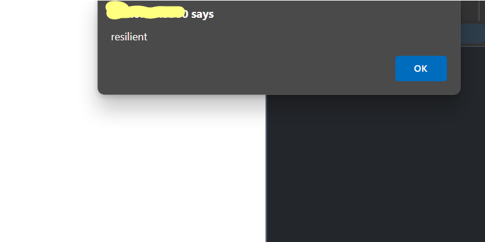

# Intermediate Javascript

## Regular expressions (Regex)
Regular expressions, also known as regex, are simply ways to describe text patterns.

The regex pattern is specified between two slashes. This is a valid regex expression:
```js
/Javascript/
```
The above expression will match if a given string contains the word `JavaScript`.
When it matches, this means the result is positive. And this can be used to do many
things.

We can use the JavaScript built-in `match()` function for this. This function returns the regex match on the result (if there is one) in the form of the substring that matched the starting position of this string and the input string.

`match()` is just a convenient function to demonstrate how regex works. 
```js
let text = "I like Javascript!";
console.log(text.match(/javascript/));
```
Console:

```
null
```
This logs `null` because it is **case-sensitive** by default and therefore is not a match.

If you want it to be **case-insensitive**, you can specify this using an `i` after the slash. In this case-insensitive example, the expression will match the previous string:
```js
console.log(text.match(/javascript/i));
```
Console:

```
[
    'JavaScript',
    index: 7,
    input: 'I love JavaScript!',
    groups: undefined
]
```
The result is an **object**, containing the found match and the index it started on, as well as the input that was looked through. 

### Specifying multiple options for words

```js
console.log(text.match(/javascript|nodejs|react/i));
```
Console:

```
[
    'JavaScript',
    index: 7,
    input: 'I love JavaScript!',
    groups: undefined
]
```
Here, the expression matches either `javascript`, `nodejs`, or `react`. At this point, we are only matching for the first encounter and then we quit. So this is not going to find two or more matches right now—it will output the same thing as before:

```js
text = "I love React and JavaScript!";
console.log(text.match(/javascript|nodejs|react/i));
```

Console:

```
[
    'React',
    index: 7,
    input: 'I love React and JavaScript!',
    groups: undefined
]
```

If we wanted to find all matches, we could specify the global modifier, `g`. It is very similar to what we did for case-insensitive searches. 

In this example, we are checking for all matches, and it is case-insensitive. All the modifiers are behind the last slash. You can use multiple modifiers at the same time as we do below, or you could decide to only use `g`:

```js
text = "I love React and JavaScript!";
console.log(text.match(/javascript|nodejs|react/gi));
```

Console:

```
[ "React", "JavaScript" ]
```

### Character options
```js
text = "d";
console.log(text.match(/[abc]/));
```
This will return `null` because d is not `a`, `b`, or `c`. We can include `d` like this:
```js
console.log(text.match(/[abcd]/));
```

Console:

```
[ 'd', index: 0, input: 'd', groups: undefined ]
```

Since this is a range of characters, we can write it shorter, like this:
```js
text = "d";
console.log(text.match(/[a-d]/));
```

Console:

```
['d', index: 0, input: 'd', groups: undefined]
```

And if we wanted **any letter, lowercase or uppercase**, we would write this:
```js
let text = "t";
console.log(text.match(/[a-zA-Z]/));
```

Console:

```
['t', index: 0, input: 't', groups: undefined]
```

We could actually also use the **case-insensitive modifier to achieve the same thing**, but this would apply to the regex pattern as a whole, and you might only need it to apply for the specific character:
```js
console.log(text.match(/[a-z]/i));
```

Console:

```
['t', index: 0, input: 't', groups: undefined]
```

We would get a match on both of the preceding options. 

If we wanted to include **numbers** as well, we would write:
```js
console.log(text.match(/[a-zA-Z0-9]/));
```

Console:

```
['t', index: 0, input: 't', groups: undefined]
```

However, these **special characters** won't match:
```js
let text = "äé!";
console.log(text.match(/[a-zA-Z0-9]/));
```

Console:

```
null
```

To address the difficulty of complex characters not matching an expression, the **dot functions** as a special **wildcard character in regex that can match any character**. 
```js
console.log(text.match(/./g));
```

Console:

```
[ "ä", "é", "!" ]
```

```js
text = "Just some text.";
console.log(text.match(/./g));
```

Console:

```
[
    'J', 'u', 's', 't',
    ' ', 's', 'o', 'm',
    'e', ' ', 't', 'e',
    'x', 't', '.'
]
```

To find a match for the **dot character itself** or a **special character (one that is used in regex to specify a pattern)**, you can escape it using the backslach:

```js
let text = "Just some text.";
console.log(text.match(/\./g));
```

Console:

```
[
    '.'
]
```

The `\d` is a special character sequence in regex that represents a **digit**. It is used to match any single digit from 0 to 9.

```js
let text = "I'm 29 years old.";
console.log(text.match(/\d/g));
```

Console:

```
[
    [ '2', '9' ]
]
```

We can also escape the s, `\s`, which matches **all whitespace characters**:
```js
let text = "Coding is a lot of fun!";
console.log(text.match(/\s/g));
```

Console:

```
[
    [ ' ', ' ', ' ', ' ', ' ' ]
]
```

`\b`, which **matches text only when it's at the beginning of a word**.

So, in the following example, it is not going to match the instances of in `in beginning`:
```js
let text = "In the end or at the beginning?";
console.log(text.match(/\bin/gi));
```

Console:

```
[
    [ 'In' ]
]
```

Even though you can check for characters being numbers, the **`match()` method belongs to the `string`** object, so you implement it on numeric variables. For example, try the following:
```js
let nr = 357;
console.log(nr.match(/3/g));
```
You should receive a `TypeError` saying that `nr.match()` is not a function.

### Groups
If you want to **match a group of characters**, you can surround them with parentheses.

Example:
```js
let text = "I love JavaScript!";
console.log(text.match(/(love|dislike)\s(javascript|spiders)/gi));
```
Here it is going to look for either `love` or `dislike`, followed by whitespace character, followed by `javascript` or `spiders`, and it will do so for all occurences while ignoring whether they are in uppercase of lowercase. This is the log:

Console:

```
['love JavaScript']
```

Let's just say we can match on roughly four combinations here. Two of them seem to make more sense:
- Love spiders
- Dislike spiders
- Love JavaScript
- Dislike JavaScript


**Match any four alphanumeric characters in a sequence**:

```js
let text = "I love JavaScript!";
console.log(text.match(/[a-zA-Z0-9][a-zA-Z0-9][a-zA-Z0-9][a-zA-Z0-9]/g));
```

Console:

```
(3) ['love', 'java', 'scri']
```

This is a terrible way to go about repeating a block: let's look for **better options**. If we only want it to be present 0 or 1 times, we can use the question mark. So this is for optional characters, for example:

```js
let text = "You are doing great!";
console.log(text.match(/n?g/gi));
```

This looks for a `g` character that may or not may be preceded by an `n`.

Console:
```
(2) ['ng', 'g']
```

If you want something at **least once, but optionally more often**, you can use the plus sign: `+`.

This is going to **match for the group 123 one or more times**. And since this string is present, it will find a match. 

Console:

```
(2) ['123123123', '123', index: 0, input: '123123123', groups: undefined]
```

It matches the whole string in this case, since it is just `123` repeated. 

There are also situations where you want to have a certain piece of regex **match any number of times**, which can be indicated with the asterisk: `*`.

```js
/(123)*a/
```

It will match with any a preceded by `123` any number of times. So it will match on the following, for example:
- 123123123a
- 123a
- a
- ba

We can be more specific as well. We do this using this syntax `{min, max}`.

```js
let text = "abcabcabc";
console.log(text.match(/(abc){1,2}/));
```

Console:
```
(2) ['abcabc', 'abc', index: 0, input: 'abcabcabc', groups: undefined]
```

It does this because it will match on `abc` both once and twice. 

`groups` is still `undefined` in the output. In order to specify groups, we'll have to name them. 

```js
let text = "I love JavaScript!";
console.log(text.match(/(?<language>javascript)/i));
```

Console:
```
(2) ['JavaScript', 'JavaScript', index: 7, input: 'I love JavaScript!', groups: {…}
```


### Practical regex

#### Searching and replacing strings

```js
let text = "That's not the case.";
console.log(text.search(/Case/i));
```

Console:

```
15
```

Adding the **`i` modifier here ignores the distinction between uppercase and lowercase**.

This code *returns `15`, which is the starting index position of the match*. 

This cannot be done using the normal string input.

**Use the global modifier(`g`) for replacing all instances rather than the first instance of a string.**

Look at this expression **without `g`**:
```js
let text = "Coding is fun. Coding opens up a lot of opportunities.";
console.log(text.replace("Coding", "JavaScript"));
```

Console:
```
JavaScript is fun. Coding opens up a lot of opportunities.
```

Without regex, it only replaces the first encounter.

With the `g` global modifier:
```js
let text = "Coding is fun. Coding opens up a lot of opportunities.";
console.log(text.replace(/Coding/g, "JavaScript"));
```

Console:
```
JavaScript is fun. JavaScript opens up a lot of opportunities.
```

Using both `g` and `i`:
```js
console.log(text.replace(/coding/ig, "Javascript"));
```

Console:
```
Javascript is fun. Javascript opens up a lot of opportunities.
```

##### Practice exercise 12.1

Find and replace strings. The following exercise involves replacing characters in a specified string value. The first input field will indicate which character string will be replaced, and the second input field will indicate which characters will replace them once the button is clicked.

```html
<!DOCTYPE html>
<html lang="en">

<head>
    <meta charset="UTF-8">
    <meta name="viewport" content="width=device-width, initial-scale=1.0">
    <title>Js course</title>
    <link rel="stylesheet" href="styles.css">
</head>
<body>
    <div id="output">Complete JavaScript Course</div>
    Search for:
    <input id="sText" type="text">
    <br> Replace with:
    <input id="rText" type="text">
    <br>
    <button>Replace</button>
    <!-- JS -->
    <script>
        const output = document.getElementById("output");
        const searchTxt = document.getElementById("sText");
        const replaceTxt = document.getElementById("rText");
        document.querySelector("button").addEventListener("click", lookUp);

        function lookUp() {
            const s = output.textContent;
            const rt = replaceTxt.value;
            const re = new RegExp(searchTxt.value, "gi");

            if (s.match(re)) {
                let newValue = s.replace(re, rt);
                output.textContent = newValue;
            }
        }
    </script>
</body>
</html>
```

#### Email validation

Email addresses consist of five parts, in the form of:

`[name]@[domain].[extension]`

Here are the five parts explained:

1. `name`: 
    - One or more alphanumerical characters,
    - underscores,
    - dashes, or
    - dots.

2. `@`:
    - Literal character

3. `domain`:
    - One or more alphanumerical characters,
    - underscores,
    - dashes, or
    - dots.

4. `.`: 
    - Literal dot

5. `extension`:
    - One or more alphanumerical characters,
    - underscores,
    - dashes, or
    - dots.

Putting it all together:
```js
/([a-zA-Z0-9._-]+@[a-zA-Z0-9._-]+\.[a-zA-Z0-9._-]+)/g
```

Let's look at this regex in action:

```js
let emailPattern = /([a-zA-Z0-9._-]+@[a-zA-Z0-9._-]+\.[a-zA-Z0-9._-]+)/g;
let validEmail = "abc_123@abcmail.com";
let invalidEmail = "abc_1@cba@.com";
console.log(validEmail.match(emailPattern));
console.log(invalidEmail.match(emailPattern));
```

Console:


More tests:


##### Practice exercise 12.2

Create an application that uses JavaScript to check whether the string value of an input is a validly formatted email using regex.

```html
<!DOCTYPE html>
<html lang="en">

<head>
    <meta charset="UTF-8">
    <meta name="viewport" content="width=device-width, initial-scale=1.0">
    <title>Js course</title>
    <link rel="stylesheet" href="styles.css">
</head>

<body>
    <div class="output"></div>
    <input type="text" placeholder="Enter Email">
    <button>Check</button>
    <!-- JS -->
    <script>
        const input = document.querySelector("input");
        const output = document.querySelector(".output");
        const rEx = /([a-zA-Z0-9._-]+@[a-zA-Z0-9._-]+\.[a-zA-Z0-9._-]+)\w+/;

        document.querySelector("button").addEventListener("click", (e) => {
            const curValue = input.value;
            const result = rEx.test(curValue);
            let response = "";

            if (!result) {
                response = "Invalid Email!";
                output.style.color = "red";
            } else {
                response = "Valid Email!";
                output.style.color = "green";
            }
            input.value = "";
            output.textContent = response;
        });
    </script>
</body>

</html>
```

Outputs:<br><br>
INPUT 1<br><br>
<br>
Output<br>
<br><br>
INPUT 2<br><br>
<br>
Output<br>
<br>

## Functions and the arguments object

Javascript deals with arguments in functions by adding them to a custom object called **`arguments`. This object works a lot like an array, and we can use it instead using the name of the parameter**. Consider the following code:

```js
function test(a, b, c) {
console.log("first:", a, arguments[0]);
console.log("second:", b, arguments[1]);
console.log("third:", c, arguments[2]);
}
test("fun", "js", "secrets");
```

Console: <br>
```
first: fun fun
second: js js
third: secrets secrets
```

When you update one of the parameters, the argument gets changed accordingly.
The same goes for the other way around;<br>

```js
function test(a, b, c) {
a = "nice";
arguments[1] = "JavaScript";
console.log("first:", a, arguments[0]);
console.log("second:", b, arguments[1]);
console.log("third:", c, arguments[2]);
}
test("fun", "js", "secrets");
```

This is going to change both `arguments[0]` and `b`, as they are related to `a` and `arguments[1]`, respectively, as you can see in the output:

```
first: nice nice
second: JavaScript JavaScript
third: secrets secrets
```

If the function is called with more arguments than were declared in the function signature, this is the way to access them. However, **the modern way is to use the rest parameter `(…param)` instead of the arguments object**.

### Practice exercise 12.3
This exercise will demonstrate using the array-like `arguments` object and extracting values from it.<br>
Using the `arguments` length property, we will iterate through the items in the arguments and return the last item in the list.

```js
function showNames() {
    let lastOne = "";
    for (let i = 0; i < arguments.length; i++) {
        lastOne = arguments[i];
        // console.log("Cur val: ", lastOne);
    }
    // console.log("Final val: ", lastOne);
    return lastOne;
}

console.log(showNames("God", "is", "with", "me,", "i", "am", "with", "GOD"));
```

Output in console:<br>
```
GOD
```

## JavaScript hoisting

We have three different variables, `const`, `let`, and `var`, and **it is highly recommended that you use `let` instead of `var` because of their different scopes**. JavaScript **hoisting** is why.<br><br>
**Hoisting** is the principle of moving declarations of variables to the top of the scope in which they are defined.<br><br>
This allows you to do things that you cannot do in many other languages, and for
good reason by the way. 

This should look normal:<br>
```js
var x;
x = 5;
console.log(x);
```

It just logs `5`. But thanks to hoisting, so does this:<br>
```js
x = 5;
console.log(x);
var x;
```

If you try to do this with let, you'll get a `ReferenceError`. This is why it is better to use `let`. Because clearly, this behavior is very hard to read, unpredictable, and you don't really need it.

The reason this happens is that the JavaScript interpreter moves all the `var` declarations to the top of the file before processing the file.<br><br>
Only the declarations, not the initializations.<br><br>
This is why you get a result of `undefined` if you use it before having initialized it. <br><br>
And this is why it should be initialized before it has been declared. <br><br>
It was designed this way for memory allocation, but the side effects are undesirable.<br>

However, there is a way to turn this behavior off. Let's see how we can do so in the next section!

## Using strict mode

We can change the understanding and forgiving behavior of JavaScript to some
extent using strict mode. You can switch on strict mode with the following command
in your code. This needs to be the first command of your code:<br>
```js
"use strict";
```

Here is something that works when we don't use strict mode:<br>
```js
function sayHi() {
    greeting = "Hello!";
    console.log(greeting);
}
sayHi();
```

We forgot to declare `greeting`, so JavaScript did it for us by adding a `greeting`
variable to the top level and it will log `Hello!`. If we enable strict mode, however,
this will give an error:<br>
```js
"use strict";
function sayHi() {
    greeting = "Hello!";
    console.log(greeting);
}
sayHi();
```

The error:<br>
```
ReferenceError: greeting is not defined
```

**You can also use strict mode only in a particular function: simply add it to the top of the function and it gets enabled for that function only.** 

Strict mode alters a few other things too; for example, **when using strict mode, there are fewer words that can be used as names for your variables and functions because they are likely to become reserved keywords in the future that JavaScript will need for its own language**.

Using strict mode is a great way of getting used to using JavaScript in the setting of frameworks or even for writing TypeScript later. 

It is typically **considered a good practice nowadays, so we would encourage you to use this in your own code when you have the chance**. 

This is often **not an (easy) option when working with existing older code though**.

Now we have seen strict mode, it's time to dive into a whole different mode: debug mode! Debug mode is for when you are not busy writing or running your application, but are running it in a special way to spot the locations of any errors.

## Debugging

Debugging is a delicate art. In the beginning, it usually is very hard to spot what's wrong with your code. If you are using JavaScript in the browser and it is not behaving as you would expect, step 1 is always to open the console in the browser. Often it will contain errors that can help you further. 

If that doesn't solve it, you can log to the console in every step of your code, and also log the variables. This will give you some insight as to what is going on. It might just be that you are relying on a certain variable that happens to be undefined. Or perhaps you are expecting a certain value from a mathematical computation, but you've made an error and the result is something completely different from what you thought. Using `console.log()` during development to see what's happening is rather common.

### Breakpoints
A more professional way to go about debugging is to use breakpoints. This can be done from most browsers and IDEs. You click on the line before your code (in the **Sources** panel in Chrome, but this may be different for different browsers), and a dot or arrow will appear. When your application is running, it will pause at this point to give you the opportunity to inspect the values of variables and walk through the
code line by line from there

This way, you will get a good clue of what is going on and how to fix it. Here is how to use breakpoints in Chrome, and most other browsers have something like this. In Chrome, go to the **Sources** tab of the **Inspect** panel. Select the file you want to set a breakpoint in. Then you just click on the line number and it sets the breakpoint:<br>


Then try to trigger the line of code, and when it gets triggered, it pauses. On the very right of the screen I can inspect all the variables and values:<br>


You can now go through your code with a fine-toothed comb: with the play icon on top, you can resume script execution (until it hits the next breakpoint or runs in to the same breakpoint again). With the round arrow icon at the top, I can go to the next line and inspect the values on the next line again.

> Recommended documentation: [Google Chrome documentation](https://developer.chrome.com/docs/devtools/javascript/breakpoints/), [Firefox](https://firefox-source-docs.mozilla.org/devtools-user/debugger/how_to/set_a_breakpoint/index.html)


### Error handling
When we are dealing with code that depends on some sort of outside input, such as an API, user input, or a file we will need to deal with the errors that this input can cause.

If we expect a certain piece of code to throw an error, we can surround this code with a **catch** block. The error it might throw will be caught in this block.

> You have to be careful not to use this too much, and you usually don't want to do this when you can just write better code to avoid the error in the first place.


Here is an example of a piece of code that throws an error, and is surrounded with a `try` and `catch` block. Let's assume the `somethingVeryDangerous()` function might throw errors:

```js
try {
    somethingVeryDangerous();
} catch (e) {
    if (e instanceof TypeError) {
        // deal with TypeError exceptions
    } else if (e instanceof RangeError) {
        // deal with RangeError exceptions
    } else if (e instanceof EvalError) {
        // deal with EvalError exceptions
    } else {
        //deal with all other exceptions
        throw e; //rethrow
    }
}
```

If it throws an error, it will end up in the `catch` block.

Since `Error` could mean many different errors, we are going to check for the exact error we are dealing with and write a specific handling of this error. We check the exact error class with the `instanceof` operator. After the error handling, the rest of the code will continue to execute normally.


You can do one more thing with a `try` `catch` block, and that is add a `finally` block.

This `finally` block gets executed irrespective ofwhether errors are thrown. This is reat for cleanup purposes. 

Here is a simple example:

```js
try {
    trySomething();
} catch (e) {
    console.log("Oh oh");
} finally {
    console.log("Error or no error, I will be logged!");
}
```

We don't know the output of this code, since `trySomething()` is not defined. If it were to throw an error, it would log `Oh oh` to the console and then `Error or no error, I will be logged!`. If `trySomething()` didn't throw an error, it would only log the last
part.

Lastly, if, for whatever reason, you need to throw an error, you can do so with the `throw` keyword, like this:

```js
function somethingVeryDangerous() {
    throw RangeError();
}
```

This can be of great use whenever you need to deal with things out of your control, such as an API response, user input, or input from reading a file. If unexpected things happen, sometimes you'll have to throw an error to deal with it appropriately

#### Practive exercise 12.5

Using throw, try, and catch, check if the value is a number, and if it's not, then create a custom error.

```js
function test(val) {
    try {
        if (isNaN(val)) {
            throw "Not a number";
        } else {
            console.log("Got number");
        }
    } catch (e) {
        console.error(e);
    } finally {
        console.log("Done" + val);
    }
}
```

Output:<br>


## Using cookies

**Cookies** are **small data files** that are *stored on your own computer* and *used by websites*.

Cookies were **invented to store things about the user of the website**.

Cookies are strings with a special pattern.

The contain key-value pairs, and these key-value pairs are separated by semi-colons.

You can create a cookie and use it again later. Here is how you can create a cookie:<br>
```js
document.cookie = "name=resilient;favouriteColor=green";
```

This does not work in all browsers when you run it on the client side (such as in `<script>` tag).

In Chrome, for example, you cannot set the cookies from the client side. You have to run the code from a server. An alternative is the web storage API.

This is how you can read from the cookie:
```js
let cookie = decodeURIComponent(document.cookie);
let cookieList = cookie.split(";");
for (let i = 0; i < cookieList.length; i++) {
    let c = cookieList[i];
    if (c.charAt(0) == " ") {
        c = c.trim();
    }
    if (c.startsWith("name")) {
        alert(c.substring(5, c.length));
    }
}
```

Output:



This example gets all the cookies using `decodeURIComponent()`, and then splits them on the `;`. This leaves us with an array, `cookieList`, with key-value pairs as strings.

Next, we loop over all the key-value pairs. Trim them (remove the whitespace in front and at the back), and see whether they start with `name`. This was the name of
our cookie key.


If we want to get the value, we have to start reading after the key, so at least the length of the key, which is 4 (name) in this case. This brings us to index 3 already.
We also want to skip the equal sign on index 4, so we start at index 5. In this case, we are adding an alert to the name. Here is an example of a simple website that uses a cookie to greet the user:

```html
<body>
    <input onchange="setCookie(this)" />
    <button onclick="sayHi('name')">Let's talk, cookie!</button>
    <p id="hi"></p>
    <script>
        function setCookie(e) {
            document.cookie = "name=" + e.value + ";";
        }
        function sayHi(key) {
            let name = getCookie(key);
            document.getElementById("hi").innerHTML = "Hi " + name;
        }
        function getCookie(key) {
            let cookie = decodeURIComponent(document.cookie);
            let cookieList = cookie.split(";");
            for (let i = 0; i < cookieList.length; i++) {
                let c = cookieList[i];
                if (c.charAt(0) == " ") {
                    c = c.trim();
                }
                if (c.startsWith(key)) {
                    console.log("hi" + c);
                    return c.substring(key.length + 1, c.length);
                }
            }
        }
    </script>
</body>
```

Output:


If you are writing a new website, you probably should not be using this. However, whenever you need to work with older code, chances are you'll come across this.


### Practice exercise 12.6

Let's make a cookie builder. Create several functions that will allow you to interact with page cookies, including reading a cookie value by name, creating a new cookie using a name and setting it for a set number of days, and deleting a cookie. 

```js
<script>
    console.log(document.cookie);
    console.log(readCookie("test1"));
    console.log(readCookie("test"));
    setCookie("test1", "new Cookie", 20);
    deleteCookie("test2");

    function setCookie(cName, value, days) {
        if (days) {
            const d = new Date();
            d.setTime(d.getTime() + (days * 24 * 60 * 60 * 1000));
            let e = "; expires=" + d.toUTCString();
            document.cookie = cName + "=" + value + e + "; path=/";
        }
    }
    function readCookie(cName) {
        let cookieValue = false;
        let arr = document.cookie.split("; ");
        arr.forEach(str => {
            const cookie = str.split("=");
            if (cookie[0] == cName) {
                cookieValue = cookie[1];
            }
        });
        return cookieValue;
    }
    function deleteCookie(cName) {
        setCookie(cName, "", -1);
    }
</script>
```

Output:


### Extra practice
Set, read, delete cookies

**Reference video**: [Learn how JavaScript COOKIES work! 🍪](https://www.youtube.com/watch?v=i7oL_K_FmM8)

HTML:
```html
<label for="firstText">first name:</label>
<input id="firstText"><br>
<label for="lastText">last name:</label>
<input id="lastText"><br>
<button id="submitBtn">submit</button>
<button id="cookieBtn">get cookies</button>
```

JAVASCRIPT:
```js
const firstText = document.querySelector("#firstText");
const lastText = document.querySelector("#lastText");
const submitBtn = document.querySelector("#submitBtn");
const cookieBtn = document.querySelector("#cookieBtn");
// event listener to set the cookie
submitBtn.addEventListener("click", () => {
    setCookie("firstName", firstText.value, 365);
    setCookie("lastName", lastText.value, 365);
});
// event listener to get the cookie
cookieBtn.addEventListener("click", () => {
    firstText.value = getCookie("firstName");
    lastText.value = getCookie("lastName");
});
// create a cookie
function setCookie(name, value, daysToLive) {
    const date = new Date();
    date.setTime(date.getTime() + (daysToLive * 24 * 60 * 60 * 1000));
    let expires = "expires=" + date.toUTCString();
    document.cookie = `${name}=${value}; ${expires}; path=/`
}
// delete a cookie
function deleteCookie(name) {
    setCookie(name, null, null);
}
// read or get a cookie
function getCookie(name) {
    const cDecoded = decodeURIComponent(document.cookie);
    const cArray = cDecoded.split("; ");
    let result = null;

    cArray.forEach(element => {
        if (element.indexOf(name) == 0) {
            result = element.substring(name.length + 1)
        }
    })
    return result;
}
```

Output:


## Local storage

