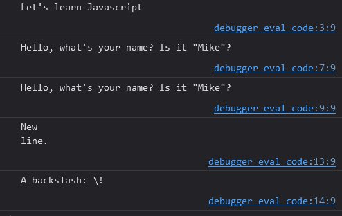

# JS Essentials

### **String**
```js
let language = "Javascript";
let message = `Let's learn ${language}`;
console.log(message); // Let's learn Javascript

// Escape characters
let str = "Hello, what's your name? Is it \"Mike\"?";
console.log(str);
let str2 = 'Hello, what\'s your name? Is it "Mike"?';
console.log(str2);

let str3 = "New \nline.";
let str4 = "A backslash: \\!";
console.log(str3);
console.log(str4);
```
Output:<br>


### **BigInt**
```js
let a = 10;
```
The limits of the number data type are between 2^53-1 and -(2^53-1) for larger numbers use `BigInt` data type. It can be recognized by the postfix ***`n`***

```js
let bigNr = 90071992547409921n;
console.log(bigNr);
```

> **Note**: We cannot mix BigInt with the Number data type to perform operations. This is something to keep in mind for later when actually working with BigInt—you can only operate on BigInt with other BigInts.

### **Symbol**
```js
let strr1 = "JavaScript is fun!";
let strr2 = "JavaScript is fun!";
console.log("These two strings are the same:", strr1 === strr2); // true
```
`Symbol` can be used when it is important that variables are not equal, even though their value and type are the same.
```js
let sym1 = Symbol("JavaScript is fun!");
let sym2 = Symbol("JavaScript is fun!");
console.log("These two Symbols are the same:", sym1 === sym2); // false
```
In the first half, JS concludes that the strings are the same. They have the same value, and the same type. However, in the second part, each symbol is unique. Therefore, although they contain the same string, they are not the same, and output false when compared.

### **Undefined**
```js
let unassigned;
console.log(unassigned); // undefined

let dontDoThis = undefined; // AVOID declaring a variable as undefined!

// null
let empty = null;
```
`null` is a special value for saying that a variable is empty or has an unknown value
```js
let lastName;
console.log("Same undefined: ", lastName === dontDoThis); // true

let betterOption = null;
console.log("Same null: ", lastName === betterOption); // false
```

### **Working out the type of a variable**
```js
testVar = 1;
varTypeTest1 = typeof testVar;
varTypeTest2 = typeof(testVar);
console.log(varTypeTest1); // number
console.log(varTypeTest2); // number
```
> Brackets aren't required because technically, `typeof` is an operator, not a method, unlike `console.log`
```js
let str_ = "hello";
let nr = 7;
let bigNr_ = 12345678901234n;
let bool = true;
let sym = Symbol("unique");
let undef = undefined;
let unknown = null;

console.log("str_", typeof str_); // string
console.log("nr", typeof nr); // number
console.log("bigNr_", typeof bigNr_); // bigint
console.log("bool", typeof bool); // boolean
console.log("sym", typeof sym); // symbol
console.log("undef", typeof undef); // undefined
console.log("unknown", typeof unknown); // object
```
Output:
```
str_ string
nr number
bigNr_ bigint
bool boolean
sym symbol
undef undefined
unknown object
```
In the output `typeof null` returns `object`, while in fact, `null` truly is a primitive and not an object. This is a bug that has been there since forever and now cannot be removed due to backward compatibility problems.

### **Converting data types**
```js
let nr1 = 2;
let nr2 = "2";
console.log(nr1 * nr2); // 4    (converts strings to numbers)
console.log(nr1 + nr2); // 22   (converts numbers to strings and then concatenates)
```

Conversion methods: `String()`,` Number()`, `Boolean()`

`String()` converts a variable to type string. It pretty much takes any value, including `undefined` and `null`, and puts quotes around it.

`Number()` converts variable to a number. If that cannot be done logically, it will change the value into `NaN` (not a number).

`Boolean()` converts a variable to a Boolean. This will be `true` for everyting except for `null`, `undefined`, `0` (number), and empty string (`""`), and `NaN`.

```js
// Example 1
let nrToStr = 6;
nrToStr = String(nrToStr);
console.log(nrToStr, typeof nrToStr); // 6 string

let strToNr = "12";
strToNr = Number(strToNr);
console.log(strToNr, typeof strToNr); // 12 number

let strToBool = "any string will return true";
strToBool = Boolean(strToBool);
console.log(strToBool, typeof strToBool); // ture boolean

// Example 2
let nullToNr = null;
nullToNr = Number(nullToNr);
console.log("null", nullToNr, typeof nullToNr); // null 0 number

let strToNr1 = "";
strToNr1 = Number(strToNr1);
console.log("empty string", strToNr1, typeof strToNr1); // empty string 0 number 

// Example 3
let strToNr2 = "hello";
strToNr2 = Number(strToNr2);
console.log(strToNr2, typeof strToNr2); // NaN number

// Example 4
let strToBool2 = "false";
strToBool2 = Boolean(strToBool2);
console.log(strToBool2, typeof strToBool2); // true boolean

let strToBool3 = "";
strToBool3 = Boolean(strToBool3);
console.log(strToBool3, typeof strToBool3); // false boolean
```

### **Arithmatic operators**
#### **Addition**
```js
let name = "Hello, my name is John, ";
let age = "I am 22 years old and ";
let canCode = "I can code Javascript: ";
let boolCode = true;
let finalStr = name + age + canCode + boolCode;
console.log(finalStr);
```
Output: `Hello, my name is John, I am 22 years old and I can code Javascript: true`
#### **Subtraction**
```js
let nrr1 = 20;
let nrr2 = 4;
let str1 = "Hi";
let nrr3 = 3;
let result1 = nrr1 - nrr2;
let result2 = str1 - nrr3;
console.log(result1, result2);
```
Output : `16 NaN`
#### **Exponentiation**
```js
nr1 = 2;
nr2 = 3;
result1 = nr1 ** nr2;
console.log(result1);
```
Output: `8`
> We can also find the root of a number by using fractional exponents: for example, the square root of a value is the same as raising it to the power of 0.5.
```js
nr1 = 36;
nr2 = 0.5;
result1 = nr1 ** nr2;
console.log(result1);
```
Output: `6`

### Practical exercise 
Write some code to calculate the hypotenuse of a triangle using the Pythagorean theorem when given the values of the other two sides.
```js
let s1 = window.prompt("Side 1: ");
let s2 = window.prompt("Side 2: ");
s1 = Number(s1);
s2 = Number(s2);
let hypot = (s1*s1 + s2*s2) ** 0.5;
console.log(`Hypotenuse = ${hypot}`);
```
